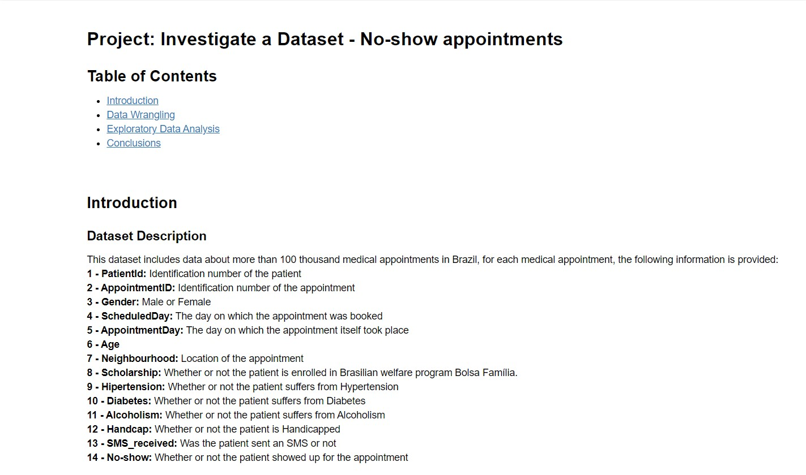
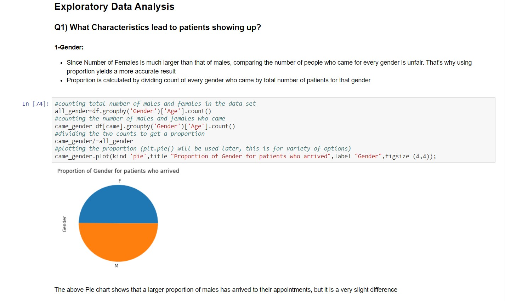

# Investigate a Dataset

This Project is a part of the Udacity Data Analysis Nanodegree

# Overview

This project makes use of Python and concepts regarding the Data Analysis Process to explore, clean, and visualize a dataset that includes data related to No-show Appointments in a clinic in Brazil, producing a report to be read by clinic officials.

# Tools Used

- Jupyter Notebook
- Python
  - NumPy
  - Pandas
  - Matplotlib
  - csv

# Features

- An Explanation of the data in the dataset
- Data Cleaning, explained and illustrated
- Exploratory Data Analysis
  - Asking different questions about the data.
  - Answering those questions by performing queries on the data.
  - Visualizing the results using charts.

# Screenshots

